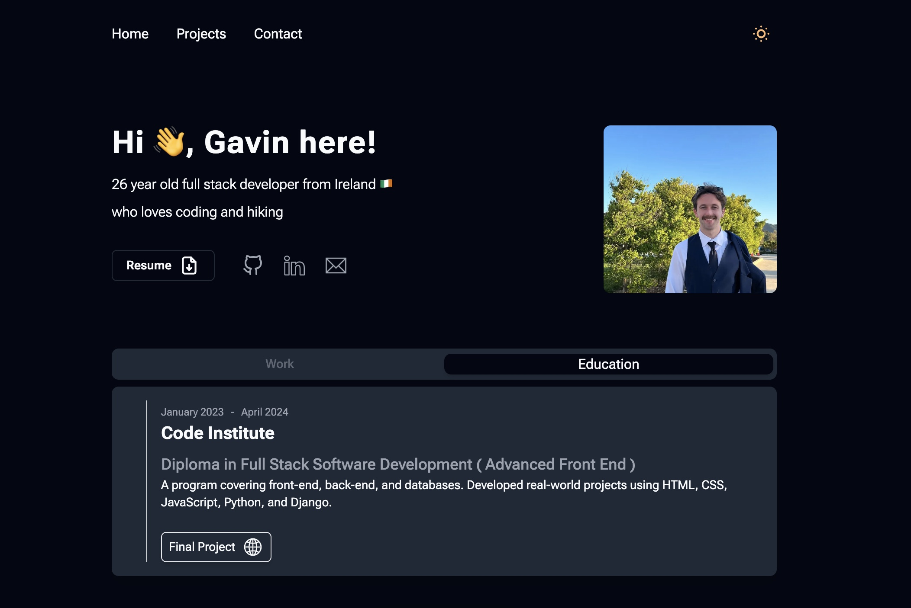
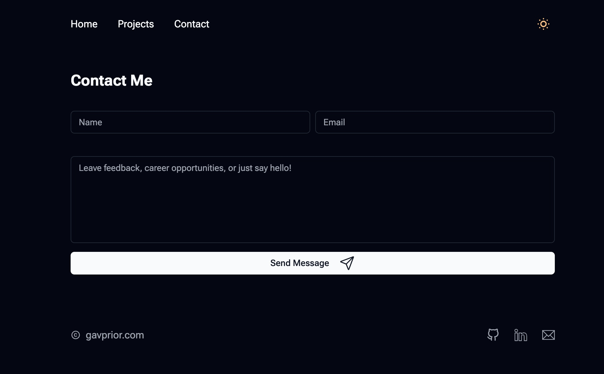
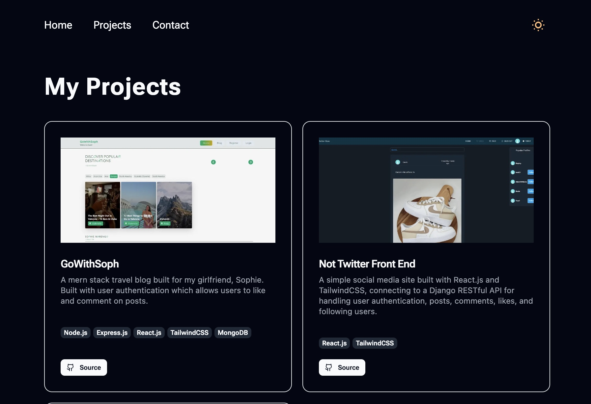

# Portfolio Website ReadMe.md



## Getting Started

First, run the development server:

```bash
npm run dev
# or
yarn dev
# or
pnpm dev
# or
bun dev
```

Open [http://localhost:3000](http://localhost:3000) with your browser to see the result.

You can start editing the page by modifying `app/page.js`. The page auto-updates as you edit the file.

This project uses [`next/font`](https://nextjs.org/docs/app/building-your-application/optimizing/fonts) to automatically optimize and load [Geist](https://vercel.com/font), a new font family for Vercel.
[Add your project setup instructions here]

## Installation

```bash
npm install
npm run dev
```

## Pages

### Contact Page Component



#### Overview

A dynamic contact form for sending messages with robust client-side validation and email integration.

#### Features

- Client-side form validation
- Email sending via EmailJS
- Real-time toast notifications
- Loading state during message submission
- Automatic redirection after successful submission

#### Validation Rules

- Name: Required
- Email: Required, must be valid format
- Message: Required, minimum 30 characters

#### Dependencies

- Axios for API requests
- React Hot Toast for notifications
- React Icons
- Next.js navigation

#### Environment Variables

Uses EmailJS configuration:

- NEXT_PUBLIC_EMAILJS_SERVICE_ID
- NEXT_PUBLIC_EMAILJS_TEMPLATE_ID
- NEXT_PUBLIC_EMAILJS_PUBLIC_KEY

#### User Experience

- Inline error messages
- Sending state with spinner
- Success toast on message send
- Automatic redirection to home page

### Projects Page Component



#### Overview

A comprehensive display of all personal projects using a dynamic ProjectCard component.

#### Features

- Full project showcase
- Responsive grid layout
- Renders all projects from external data source

#### Dependencies

- ProjectCard component
- Project data from external source

#### Layout

- Grid display (1 column on mobile, 2 columns on larger screens)
- Large header "My Projects"

#### Data Requirements

Project data array with each project containing:

- title
- description
- imageSrc
- tags
- githubLink

#### Customization

- Modify grid layout via Tailwind CSS classes
- Easily update project list by changing projectData

## Technologies & Libraries

### Next.js

[Next.js](https://nextjs.org/) is a powerful React framework that enables server-side rendering, static site generation, and provides an enhanced development experience. It offers built-in optimizations for performance and SEO, making it an ideal choice for modern web applications.

### TailwindCSS

[TailwindCSS](https://tailwindcss.com/) is a utility-first CSS framework that allows rapid UI development by providing low-level utility classes. It enables developers to build custom designs without leaving your HTML, offering flexibility and performance through its purge and optimization features.

### React & React DOM

[React](https://reactjs.org/) is a popular JavaScript library for building user interfaces, allowing developers to create reusable UI components. [React DOM](https://reactjs.org/docs/react-dom.html) provides DOM-specific methods for rendering React components in web browsers.

### Axios

[Axios](https://axios-http.com/) is a promise-based HTTP client for making seamless API requests. It supports interceptors, automatic transforms for JSON data, and works in both browser and Node.js environments, simplifying data fetching and communication.

### React Icons

[React Icons](https://react-icons.github.io/react-icons/) offers a comprehensive collection of popular icon packs as React components. It provides easy integration of icons from libraries like Font Awesome, Material Design, and more with minimal configuration.

### React Hot Toast

[React Hot Toast](https://react-hot-toast.com/) is a lightweight, customizable notification library for React applications. It provides beautiful, responsive toast notifications with simple and flexible APIs for various use cases.

### EmailJS

[EmailJS](https://www.emailjs.com/) enables sending emails directly from client-side JavaScript, eliminating the need for a backend email service. It integrates with multiple email providers and supports template-based email composition.

## Reusable Components

### Navbar Component

#### Overview

A responsive navigation component with a dynamic theme toggle functionality.

#### Features

- Responsive navigation menu with key page links
- Dark/Light theme switcher
- Persistent theme preference using localStorage
- Adaptive to system color scheme preference

#### Theme Management

- Supports both manual theme switching and system preference detection
- Saves user's theme preference in localStorage
- Dynamically updates body class for theme styling

#### Icons

- Uses React Icons for theme toggle:
  - Moon icon for dark mode
  - Sun icon for light mode

#### Usage

```jsx
import Navbar from "./components/Navbar";

export default function RootLayout({ children }) {
  return (
    <html lang="en" className={`${robotoFlex.className}`}>
      <body className="dark flex flex-col justify-center items-center max-w-3xl bg-background overflow-x-hidden mx-8 sm:mx-auto">
        <Navbar />
        {children}
        <Footer />
      </body>
    </html>
  );
}
```

### Personal Intro Component

#### Overview

A responsive personal introduction section featuring profile image, brief description, resume download, and social media links.

#### Features

- Responsive layout (mobile and desktop views)
- Profile image with Next.js Image optimization
- Resume download button
- Social media links (GitHub, LinkedIn, Email)
- Internationalization (Irish flag emoji)

#### Dependencies

- Next.js Image component
- React Icons:
- TbFileDownload
- FiGithub
- SlSocialLinkedin
- TfiEmail

#### Customization

- Easily update personal details
- Modify social media links
- Adjust styling via Tailwind CSS classes

#### Assets Required

- Profile image at `/images/hero.jpg`
- Resume PDF at `/images/resume.pdf`

### InfoTabs Component

#### Overview

An interactive tab component for displaying work and education information with dynamic content switching.

#### Features

- Two-tab interface (Work and Education)
- State-based tab management
- Responsive design
- Conditional rendering of tab content
- Placeholder for work experience
- Detailed education information

#### Dependencies

- React Hooks (useState)
- React Icons:
- IoIosGlobe
- BiSmile
- BiWinkSmile

#### Customization

- Easily modify tab labels
- Add more detailed work or education information
- Adjust styling via Tailwind CSS classes

#### Current Content

- Education tab displays:
- Code Institute Diploma details
- Course duration
- Program description
- Link to final project

#### Placeholder

- Work experience tab currently shows a playful "404 not found" message

#### Styling

- Uses Tailwind CSS for responsive and interactive design
- Dynamic button states for active/inactive tabs
- Shadow and background color variations

### FeaturedProjects Component

#### Overview

A section displaying a curated selection of featured projects with a link to view more.

#### Features

- Dynamically renders first two projects from project data
- "View More" link to full projects page
- Responsive grid layout
- Uses separate ProjectCard component for individual project display

#### Dependencies

- Next.js Link component
- React Icons:
- IoIosArrowRoundForward
- Project data from external source
- ProjectCard component

#### Data Requirements

- `projectData` array with project objects containing:
- title
- description
- imageSrc
- tags
- githubLink

#### Layout

- Grid display (1 column on mobile, 2 columns on larger screens)
- Header with "Featured Projects" title
- "View More" navigation link

#### Customization

- Modify number of featured projects by changing `.slice(0, 2)`
- Adjust grid layout via Tailwind CSS classes

### Footer Component

#### Overview

A minimalist footer component with copyright notice and social media links.

#### Features

- Copyright display
- Social media link icons
- Responsive layout
- Hover effects on social icons

#### Dependencies

- React Icons:
- FiGithub
- MdOutlineCopyright
- SlSocialLinkedin
- TfiEmail

#### Social Links

- GitHub
- LinkedIn
- Email

#### Customization

- Easily update copyright text
- Modify social media link URLs
- Adjust styling via Tailwind CSS classes

## Acknowledgements

This project's design was inspired by [Ted's portfolio website design](https://tedawf.com/). Credit goes to Ted for the original design that served as a creative reference for this portfolio.
